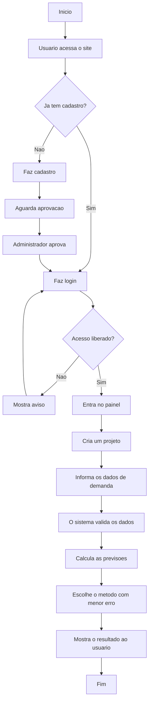

# Documentação breve do projeto

## Parte tecnológica

O projeto é um site feito para ajudar no controle e na previsão de demandas. Nele, o usuário pode criar uma conta, cadastrar projetos, informar os dados de demanda e visualizar uma previsão para o próximo período.

Na parte visual do site foram usadas as tecnologias HTML, CSS e JavaScript. Elas são responsáveis pelas telas, botões, formulários, cores, organização das páginas e interações do usuário com o sistema.

Na parte interna do sistema foi usada a linguagem Python com o framework Flask. Essa parte é responsável por receber os dados digitados pelo usuário, validar as informações, fazer login, criar projetos e executar os cálculos de previsão.

Para armazenar as informações foi utilizado um banco de dados PostgreSQL. Ele guarda os usuários cadastrados, os projetos criados e os valores de demanda informados em cada período.

O sistema também possui uma área administrativa, onde o administrador pode aprovar ou reprovar usuários antes que eles tenham acesso ao site.

## Como o sistema funciona

Primeiro, o usuário faz o cadastro no site. Depois, o administrador aprova esse cadastro. Com o acesso liberado, o usuário entra no sistema e cria um projeto, informando o nome, o responsável, a descrição e os valores de demanda.

Esses valores podem ser digitados manualmente ou importados por uma planilha Excel. Depois disso, o sistema analisa os dados usando diferentes métodos de previsão e escolhe o resultado que apresenta o menor erro.

No final, o usuário consegue ver qual foi o melhor método encontrado, o erro médio e a previsão de demanda para o próximo período.

## Fluxograma

